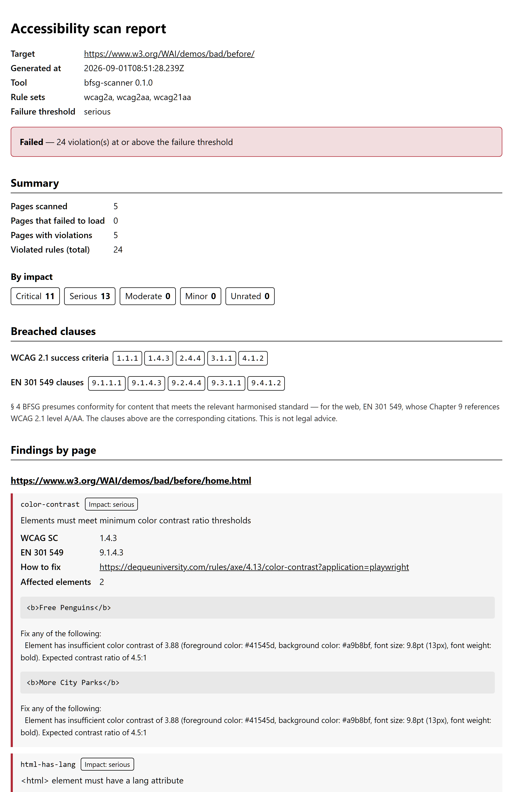

# bfsg-scanner

[](https://www.npmjs.com/package/bfsg-scanner)
[](https://github.com/MihaelaAghirculesei/bfsg-scanner/actions/workflows/ci.yml)
[](https://www.npmjs.com/package/bfsg-scanner#provenance)
[](https://nodejs.org)
[](./LICENSE)

**Since 28 June 2025, Germany's [BFSG](https://www.gesetze-im-internet.de/bfsg/)
has made digital accessibility a legal requirement for many consumer-facing
businesses — online shops, banking, booking, ticketing and more.**
`bfsg-scanner` scans a whole site for
[WCAG 2.1 AA](https://www.w3.org/TR/WCAG21/) breaches and turns them into a
citeable conformance report you can file as a record or use to gate a release.

Built on [Playwright](https://playwright.dev) and
[axe-core](https://github.com/dequelabs/axe-core). Every finding is mapped
through [EN 301 549](https://www.etsi.org/deliver/etsi_en/301500_301599/301549/)
to the BFSG clause it breaches — not left as a bare rule ID.

Requires **Node.js ≥ 24**.

> **How I use it:** a one-command accessibility audit of a client site before
> launch. Pointed at the W3C's
> [deliberately inaccessible demo](https://www.w3.org/WAI/demos/bad/), a run
> flags **24 issues across 5 pages** — 11 critical, 13 serious — each tagged
> with its WCAG success criterion and EN 301 549 clause, in one PDF for the file.

[](https://mihaelaaghirculesei.github.io/bfsg-scanner/)

<sub>A real run against the W3C WAI Before/After Demonstration ·
[open the rendered report](https://mihaelaaghirculesei.github.io/bfsg-scanner/) ·
[HTML](./examples/report.html) · [JSON](./examples/report.json) · [PDF](./examples/report.pdf)</sub>

## What it does

1. **Discovers** the pages of a site — `sitemap.xml` first, then a
   `robots.txt`-respecting breadth-first crawl, bounded by `maxPages`.
2. **Scans** each page in a real Chromium via axe-core, with a concurrency
   pool and a per-host rate limit, sending an identifiable User-Agent.
3. **Reports** the result as `report.json`, `report.html` (German or English),
   and `report.pdf`, with each violation tagged with its WCAG success
   criteria and EN 301 549 clauses.
4. **Exits non-zero** when violations reach a configurable severity
   threshold, so a CI job can gate a merge on accessibility.

## Quick start

```sh
npx bfsg-scanner https://example.de

# scan one page, JSON only, fail the process on any "critical" finding:
npx bfsg-scanner https://example.de --format json --fail-on critical
```

The first run needs a Chromium build for Playwright:

```sh
npx playwright install chromium
```

Install it for repeated use with `npm i -g bfsg-scanner`.

## From source

```sh
git clone https://github.com/MihaelaAghirculesei/bfsg-scanner.git
cd bfsg-scanner
npm install
npx playwright install chromium
npm run build
node dist/cli/index.js --help   # or `npm link` for the bfsg-scanner command
```

## Usage

```
bfsg-scanner [url] [options]
```

| Argument / option        | Meaning |
|--------------------------|---------|
| `url`                    | Base URL to scan. Omit it to load a config file instead. |
| `-c, --config <path>`    | YAML config file (default: `bfsg.config.yaml`). Not allowed together with a `url`. |
| `--fail-on <level>`      | `critical` \| `serious` \| `moderate` \| `minor` (default: `serious`). |
| `--report-language <l>`  | `de` \| `en` (default: `de`). |
| `--output-dir <dir>`     | Directory for the report files (default: `reports`). |
| `--format <list>`        | Comma-separated subset of `json,html,pdf` (default: all three). |
| `-h, --help`             | Show help and exit. |
| `-V, --version`          | Print the version and exit. |

A `url` argument scans that one page with defaults; anything more (a page
budget, excluded paths, a custom rule set) needs a config file.

## Configuration

A YAML file — `bfsg.config.yaml` by default, or `--config <path>`. Only
`baseUrl` is required; every other key falls back to the default shown.

```yaml
baseUrl: "https://example.de"     # required

maxPages: 50                      # sitemap + crawl combined
wcagTags:                         # axe rule sets to run
  - wcag2a
  - wcag2aa
  - wcag21aa
excludePaths: []                  # URL-path globs to skip while crawling
outputDir: reports                # where the report files are written
failOn: serious                   # critical | serious | moderate | minor
reportLanguage: de                # de | en — language of the HTML/PDF report
reportFormats:                    # any non-empty subset of json | html | pdf
  - json
  - html
  - pdf
```

CLI flags override the matching config key. See the annotated
[`bfsg.config.yaml`](./bfsg.config.yaml) in this repo for a working example.

## Output

Written to `outputDir`, overwritten each run:

- **`report.json`** — the machine-readable result. Its shape is described by
  [`schema/report.v1.json`](./schema/report.v1.json) (JSON Schema, shipped
  with the package); `schemaVersion` is `1`.
- **`report.html`** — a self-contained page (no external assets) leading with
  the pass/fail verdict, the breached WCAG / EN 301 549 clauses, and the
  findings per page.
- **`report.pdf`** — the HTML report printed to A4, for filing as the
  compliance record.

The terminal prints a summary and the distinct breached clauses.

## Exit codes

| Code | Meaning |
|------|---------|
| `0`  | Scan completed; nothing at or above `--fail-on`. |
| `1`  | Scan completed; violations at or above `--fail-on`. |
| `2`  | Invalid arguments or configuration. |
| `3`  | No pages discovered, or a page could not be scanned. |

`3` outranks `1`: a run with unreachable pages scanned an incomplete site, so
"no violations found" would be a claim the data cannot support.

## How the clause mapping works

axe-core's rule metadata already carries the mapping: a rule tagged
`wcag143` checks WCAG SC 1.4.3, `EN-9.1.4.3` maps it to that EN 301 549
clause. The scanner reads those tags rather than maintaining a hand-authored
table. § 4 BFSG presumes conformity for content that meets the relevant
harmonised standard — for the web, EN 301 549, whose Chapter 9 references
WCAG 2.1 level A/AA — so the EN 301 549 clauses in the report are the
corresponding citations. This is not legal advice.

## Responsible use

This tool sends real traffic to whatever site you point it at. Scan only
sites you own or are authorised to test. See
[`docs/SCANNING-ETHICS.md`](./docs/SCANNING-ETHICS.md).

## Design decisions

Each significant choice is recorded as an ADR in [`docs/adr/`](./docs/adr).

## License

[MIT](./LICENSE)
